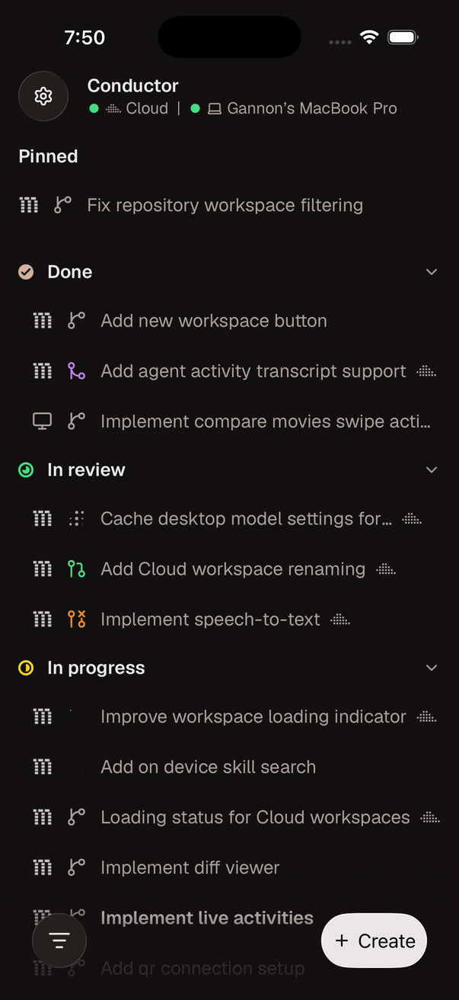
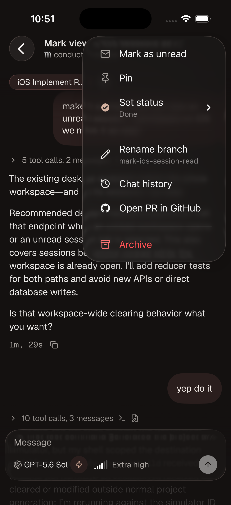

# *Unofficial* Conductor.build iOS app

A native-iOS app prototype for [Conductor.build](https://conductor.build), supporting both local and cloud workspaces.

## Screenshots

||||
|--|--|--|

## Installation

### Prerequites

Install [Homebrew](https://brew.sh/), then run:

```bash
brew install mise xcodegen xcbeautify
```

(`xcbeautify` is only needed for development / building from the command line)

### iOS

Steps:
1. Install Xcode 26

    a. I recommend installing it through https://www.xcodes.app/ for convenience. Any Xcode 26 version should do

    b. Otherwise, you can download it from the [Mac App Store](https://apps.apple.com/us/app/xcode/id497799835?mt=12)

2. Clone the repo & run `mise run xcode` to generate the Xcode project + open it.
3. In Xcode, click on the `ConductorMobile` project, then go to Signing & Capabilities -> Team -> Select your developer team

    a. Alternatively, give an agent your team ID and have it swap it in in xcodegen's [project.yml](ios/project.yml)

4. In the top-center bar select the scheme (left button) and change it to `ConductorMobile`. Then choose your physical device in the next dropdown

    a. If you haven't connected it to your Mac before, you'll need to plug it in with a cable. After this initial pairing you can deploy it over Wi-Fi.

6. Press Run (Cmd+R)

### Desktop Companion

In order to read and write to local workspaces, as well as support features the public Conductor Cloud API doesn't support yet like GitHub PR status, unread statuses, and queued messages, you can install our macOS companion app. You can grab it from [Releases](https://github.com/gannonprudhomme/conductor-mobile-unofficial/releases), or build it yourself with `mise run desktop`.

## Setup

#### UI Hook

After downloading & launching the macOS app, you must install the "UI hook" into the Conductor macOS app to actually _control_ local workspaces:
1. Press `Copy Loader` in the `Conductor Mobile Companion` (aka "Desktop Companion")
2. In Conductor, press `⌘+⌥+I` to display the Web Inspector
3. Go to the `Sources` tab
4. Press the `+` button in the bottom left, and select `Console Snippet`


5. Paste the loader script, name it whatever (e.g. `"Conductor Mobile"`).
6. In the `Console Snippet` section, hover over the script you added and press the Run button:


7. Back in the desktop app, it should say "Connected" on the UI Hook row.

## How does it work?

### Reading data

For local workspaces, we read Conductor's local SQLite database.
Assuming the iOS app is connected, we poll `PRAGMA data_version` very rapidly - every 3 ms - and if there are any changes to the tables/IDs we're monitoring we send them to the app over a web socket.

For Cloud workspaces we generally use Conductor's public API. However the public API is missing a handful of features, like queued messages, GitHub PR status, etc, so we instead retrieve that information from the local SQLite database when available.

### Writing data through the UI hook

While Conductor does use SQLite to persist pretty much all of it's data, writing to the database doesn't actually propagated the changes to the UI, nor cause messages to be sent to the agent.

As a result of this, we install a "UI Hook" where instead of writing the data to the database, we install a script* in Tauri's Web Inspector. The Desktop companion connects to this script and sends commands to it whenever requested from the mobile app.

*the `Copy loader` [script](desktop/workspace-hook/bootstrap-loader.js) isn't the UI hook itself. It instead retrieves & executes the [actual UI hook](desktop/workspace-hook/browser-hook.mjs) from the desktop companion web server. This is mostly so it automatically updates itself during development.

### iOS

The iOS app is a native iOS app, implemented using SwiftUI and [TCA](https://github.com/pointfreeco/swift-composable-architecture).
We use UIKit sparingly whenever required, namely for the chat view itself, as the desired performance and scrolling behavior was only consistently achievable with UIKit. (specifically a `UICollectionView`)

We use [sqlite-data](https://github.com/pointfreeco/sqlite-data) as our backing store and cache.
Our SQLite tables are generally a 1:1 match to Conductor's schema, though we often store extra "metadata" in sibling tables we JOIN on.

## Development

Your agent can probably figure it out, but I'll leave this in here in case you want to read. For the most part the `mise` scripts is what my agent uses. I also recommend installing [Xcodebuildmcp](https://github.com/getsentry/XcodeBuildMCP) as it gives easy access for your agent to "see", among other things, though it's not strictly necessary.

Generate both native projects and open them in Xcode with:

```sh
mise run xcode
```

Build the iOS app with:

```sh
mise -C ios run build
# or
cd ios && mise run build
```

Deploy to the simulator with
```sh
mise -C ios run deploy
```

Build and run the native macOS companion with:

```sh
mise run desktop
```
