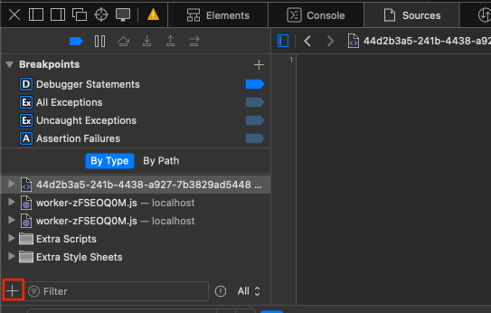
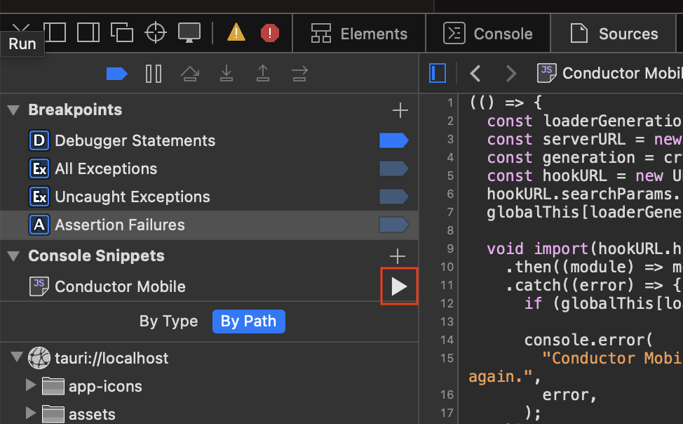

# *Unofficial* Conductor.build iOS app

A native iOS app for Conductor.build while we're waiting for the official one to come out.

## Installation

### Prerequites

Install [Homebrew](https://brew.sh/), then run:

```bash
brew install mise xcodegen xcbeautify
```

(`xcbeautify` is only needed for development / building from the command line)

### iOS

Note: You can use an [Apple Personal Team](https://developer.apple.com/help/account/basics/about-your-developer-account) to install the iOS app to your physical device, but it will expire after 7 days. For it to last longer, you'll need an Apple Developer Account ($100/yr).

Steps:
1. Install Xcode 26

  a. I recommend installing it through https://www.xcodes.app/ for convenience. Any Xcode 26 version will do
  b. Otherwise, you can download it from the [Mac App Store](https://apps.apple.com/us/app/xcode/id497799835?mt=12)
  
2. Clone the repo
3. Run `mise run xcode`
4. In Xcode, click on the `ConductorMobile` project, then go to Signing & Capabilities -> Team -> Select your developer team

  a. Remember to log in in Xcode -> Settings -> Accounts

5. In the top-center bar select the left button (likely something like `ConductorDataTests` or something) and change it to `ConductorMobile`. Then choose your physical device

  a. If you haven't connected it to your Mac before, you'll need to plug it in with a cable. After this initial pairing you can deploy it over Wi-Fi.

6. Press Run (Cmd+R)
7. Proceed to desktop steps

### Desktop Companion

In order to be able to actually control Conductor **remotely**, you need to install the desktop "companion". You can grab it from [Releases](https://github.com/gannonprudhomme/conductor-mobile-unofficial/releases), or build it yourself with `mise run desktop`.

#### UI Hook (for sending messages, stopping agents, renaming branches, and changing Conductor state)

1. Press `Copy Loader`
2. In Conductor, press Cmd+Opt+I to display the Web Inspector
3. Go to the `Sources` tab
4. Press the `+` button in the bottom left, and select `Console Snippet`



5. Paste the loader script, name it whatever (e.g. `"Conductor Mobile"`).
6. In the `Console Snippet` section, hover over the script you added and press the Run button:



7. Back in the desktop app, it should say "Connected" on the UI Hook row.

> Upgrading from the proxy-based companion: uninstall the proxy with the old
> companion and restart Conductor before upgrading. If you already upgraded
> without uninstalling it, reinstall Conductor to restore its runtime.

## Setup

When you open the iOS app it'll immediately open the Settings screen in order to connect to your Mac. You can use your laptop's local IP address if you only want access over LAN. Howveer, assuming you want to access Conductor remotely, I recommend installing [Tailscale](https://tailscale.com/). It's free and quick & easy to setup.

1. Download Tailscale on your iPhone and Mac, sign in on both devices, and turn it on on both
  a. It's recommended to enable `VPN on Demand` on the iOS app.
2. Find the MagicDNS name of the Mac you want to connect to. E.g. mine is `gannons-macbook-pro-2`
3. In the iOS app, enter the MagicDNS name in the `Host IP address` field, and optionally configure the display name & icon
4. Press `Test` and ensure it works!
  a. A green checkmark should appear to right of `Host IP address`
6. Profit

## How does it work?

### Experimental Conductor Cloud API

The iOS app can validate and store a Conductor Cloud API key from Settings, then
show the authenticated account's cloud workspaces in the existing workspace
list. The key is stored in the device Keychain; only non-secret configuration
and account identifiers are stored in app support.

Cloud projects, workspaces, and lifecycle status are fetched from the fixed
production API and cached in the mobile SQLite database. Cloud and desktop
observations merge into one canonical workspace row: Cloud metadata supplies
lifecycle state, while a paired desktop supplies richer working and
pull-request state. Cached rows remain visible after relaunch and during
offline refresh failures. API-only rows are display-only; a row becomes
navigable when the desktop companion observes the same workspace ID. Local
pairing continues to operate without a cloud credential, and a saved Cloud
credential is enough to browse the catalog without pairing a Mac.

Opening cloud workspaces, cloud chat, polling transcripts, sending or stopping
agents, and creating cloud workspaces or sessions are deliberately deferred.

### Reading data

For the most part all of the data we get is from Conductor's SQLite database. Assuming the iOS app is connected, we poll `PRAGMA data_version` very rapidly - every 3 ms, which you might want to reduce - and if there are any changes we send them to the app over a web socket.

### Writing data

#### UI hook

> Note: This hook is required for sending messages, stopping agents, branch renames, and for seeing Status, Unread, Pinned, etc. changes propagate to Conductor without restarting it.

While Conductor does use SQLite to persist pretty much all of it's data, just writing to the database does not mean you will see the changes propagated in Conductor - at least not when it's open. (if you write to the SQLite database then restart, you will see them)

As a result of this, we install a "UI Hook" where instead of writing the data to the database, we install a script in Tauri's Web Inspector which connects to the desktop companion using Server Sent Events (SSEs). Sends and stops call Conductor's own loaded message-processing controller and report explicit acceptance or rejection to the companion. SQLite remains authoritative for persisted messages and the final stopped session, which still arrive on the phone through database-backed WebSocket observation.


## Missing features

The core of it works for what I personally need (from my testing!), but I'm certainly missing a ton of features:

- Conductor Cloud chat, navigation, and workspace/session creation
- File diffs / file viewing
  - I just use GitHub for this!
- Tool use results
- Create PR / Create draft PR button
- Plan mode
- Cursor models & OpenCode
  - This might work if Conductor uses the same schema as Codex & Claude code, but I haven't tested them.
- Displaying available skills & MCPs
- Viewing PRs
- Displaying Codex goals
- Parsing subagent actions
- Parsing thinking actions
- Displaying context usage
- Showing compaction
- Terminal access
- Run status
- Attaching files from the app

## Development

Your agent can probably figure it out, but I'll leave this in here in case you want to read. For the most part the `mise` scripts is what my agent uses. I also recommend installing [Xcodebuildmcp](https://github.com/getsentry/XcodeBuildMCP) as it gives easy access for your agent to "see", among other things, though it's not strictly necessary.

Generate both native projects and open them in Xcode with:

```sh
mise run xcode
```

Build the iOS app with:

```sh
mise -C ios run build
# or
cd ios && mise run build
```

Deploy to the simulator with
```sh
mise -C ios run deploy
```

Build and run the native macOS companion with:

```sh
mise run desktop
```
